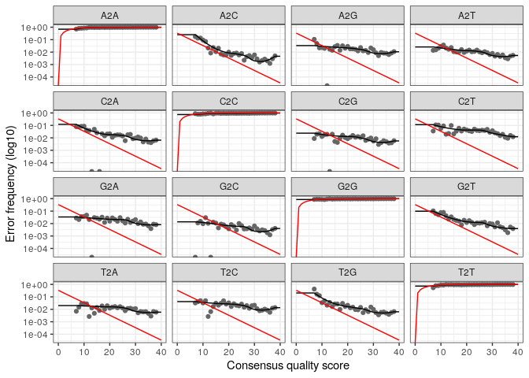

R Notebook
================

------------------------------------------------------------------------

``` bash
wget https://github.com/ANF-MetaBioDiv/course-material/archive/refs/heads/main.zip
unzip main.zip
```

## here::here dans le package here cherche le dossier here.

``` r
refdb_folder <- here::here("data", "refdb")
refdb_folder
```

    ## [1] "/home/rstudio/ADM2023_tutoriel/data/refdb"

``` r
if (!dir.exists(refdb_folder))
  dir.create(refdb_folder, recursive = TRUE)
```

``` bash
cp -R course-material-main/data/raw/ ./data/
```

``` r
getOption("timeout")
```

    ## [1] 60

# on défini une nouvelle variable qui reçoit le chemin dans fdb folder.

``` r
silva_train_set <- file.path(refdb_folder,
                             "silva_nr99_v138.1_train_set.fa.gz")
```

# On créé une nouvelle variable

``` r
silva_species_assignment <- file.path(refdb_folder,
                                      "silva_species_assignment_v138.1.fa.gz")
```

``` r
if (!file.exists(silva_train_set)) {
  download.file(
    "https://zenodo.org/record/4587955/files/silva_nr99_v138.1_train_set.fa.gz",
    silva_train_set,
    quiet = TRUE
  )
}
```

``` r
if (!file.exists(silva_species_assignment)) {
  download.file(
    "https://zenodo.org/record/4587955/files/silva_species_assignment_v138.1.fa.gz",
    silva_species_assignment,
    quiet = TRUE
  )
}
```

    ## ℹ Loading ANF_metaB

``` r
path_to_fastqs <- here::here("data", "raw")
```

## path_to_fastqs permet de montrer les chemins qui vont vers les fichiers

``` r
fnFs <- sort(list.files(path_to_fastqs,
                        pattern = "_R1.fastq.gz",
                        full.names = TRUE))
```

``` r
fnRs <- sort(list.files(path_to_fastqs,
                        pattern = "_R2.fastq.gz",
                        full.names = TRUE))
```

``` r
sample_names <- basename(fnFs) |>
  strsplit(split = "_") |>
  sapply(head, 1)
```

``` r
basename(fnFs) |>
  head()
```

    ## [1] "S11B_R1.fastq.gz" "S1B_R1.fastq.gz"  "S2B_R1.fastq.gz"  "S2S_R1.fastq.gz" 
    ## [5] "S3B_R1.fastq.gz"  "S3S_R1.fastq.gz"

## coupe/sépare au niveau des tirets (\_)

``` r
basename(fnFs) |>
  strsplit(split = "_") |>
  head()
```

    ## [[1]]
    ## [1] "S11B"        "R1.fastq.gz"
    ## 
    ## [[2]]
    ## [1] "S1B"         "R1.fastq.gz"
    ## 
    ## [[3]]
    ## [1] "S2B"         "R1.fastq.gz"
    ## 
    ## [[4]]
    ## [1] "S2S"         "R1.fastq.gz"
    ## 
    ## [[5]]
    ## [1] "S3B"         "R1.fastq.gz"
    ## 
    ## [[6]]
    ## [1] "S3S"         "R1.fastq.gz"

## On ne prend seulement que le premier élément de cette liste.

``` r
basename(fnFs) |>
  strsplit(split = "_") |>
  sapply(head, 1) |>
  head()
```

    ## [1] "S11B" "S1B"  "S2B"  "S2S"  "S3B"  "S3S"

``` r
gsub("^.+/|_.+$", "", fnFs) |> head()
```

    ## [1] "S11B" "S1B"  "S2B"  "S2S"  "S3B"  "S3S"

``` r
# create a directory for the outputs
quality_folder <- here::here("outputs",
                             "dada2",
                             "quality_plots")

if (!dir.exists(quality_folder)) {
  dir.create(quality_folder, recursive = TRUE)
}

qualityprofile(fnFs,
               fnRs,
               file.path(quality_folder, "quality_plots.pdf"))
```

    ## png 
    ##   2

``` r
path_to_trimmed_reads <- here::here(
  "outputs",
  "dada2",
  "trimmed"
)

if (!dir.exists(path_to_trimmed_reads)) dir.create(path_to_trimmed_reads, recursive = TRUE)
```

``` r
primer_fwd  <- "CCTACGGGNBGCASCAG"
primer_rev  <- "GACTACNVGGGTATCTAAT"
```

``` r
Biostrings::readDNAStringSet(
  fnFs[1],
  format = "fastq",
  nrec = 10
)
```

    ## DNAStringSet object of length 10:
    ##      width seq                                              names               
    ##  [1]   293 CCTACGGGGGGCAGCAGTAGGGA...ACATCGGCTTAACCGATGAAGT M01522:260:000000...
    ##  [2]   293 CCTACGGGTGGCACCAGTAGGGA...CGGGGCTTAACCTCGGAACTGC M01522:260:000000...
    ##  [3]   292 CCTACGGGGCGCAGCAGGCGCGA...GGGACCGGGAGAGGTGTGAGGT M01522:260:000000...
    ##  [4]   293 CCTACGGGGTGCAGCAGTAGGGA...TCAAAACTCCCAGTCTAGAGTT M01522:260:000000...
    ##  [5]   291 CCTACGGGTGGCAGCAGTGGGGA...GCAGTGGAAACTGTTGGGCTTG M01522:260:000000...
    ##  [6]   293 CCTACGGGATGCAGCAGGCGCGA...GGGACCGGGAGAGGTGTGGGGG M01522:260:000000...
    ##  [7]   292 CCTACGGGATGCAGCAGTGGGGA...TTTAATCCTGATGAGCTAGAAA M01522:260:000000...
    ##  [8]   293 CCTACGGGGCGCAGCAGTAGGGA...TTAAAACTTTTGTTCTGGAATT M01522:260:000000...
    ##  [9]   292 CCTACGGGTTGCAGCAGTGGGGA...ATTAAAACTTTTCAGCTAGAGT M01522:260:000000...
    ## [10]   293 CCTACGGGAGGCAGCAGTGGGGA...CCCGGGCTCAACCTGGGAACGG M01522:260:000000...

``` r
Biostrings::readDNAStringSet(
  fnRs[1],
  format = "fastq",
  nrec = 10
)
```

    ## DNAStringSet object of length 10:
    ##      width seq                                              names               
    ##  [1]   301 GACTACCAGGGTATCTAATCCTG...GGCTGCTGGCACGAAGTTCGCC M01522:260:000000...
    ##  [2]   301 GACTACCGGGGTATCTAATCCTG...GGCTGCTGGCACGGAGTTAGCC M01522:260:000000...
    ##  [3]   300 AATCCGGTTCGTGCCCCTAGGCT...TCTTTCCCAGCCCTTATTCCAA M01522:260:000000...
    ##  [4]   301 GACTACCGGGGTATCTAATCCTG...GGCTGCTGGCACGGAGTTAGCC M01522:260:000000...
    ##  [5]   301 GACTACCGGGGTATCTAATCCCT...GGCTGCTGGCCCGGAATTAGCC M01522:260:000000...
    ##  [6]   301 GGTATCTAATCCGGTTCGTGCCC...CACCGTCCTTACCCCCCCCTTT M01522:260:000000...
    ##  [7]   301 GGTATCTAATCTTGTTTGCTCCC...CCCGACGTTAGCCGGGGCTTCT M01522:260:000000...
    ##  [8]   301 GACTACGAGGGTATCTAATCCCG...GGCTGCTGGCACGGAATTAGCC M01522:260:000000...
    ##  [9]   301 GGTATCTAATCCTCTTCGCTACC...CACGAAGTTAGCCGGACCTTCT M01522:260:000000...
    ## [10]   301 GACTACGGGGGTATCTAATCCTG...GGCTGCCGGCACGGGGTTAGCC M01522:260:000000...

``` bash
pwd
cp -R /home/rstudio/ADM2023_tutoriel/course-material-main/bash .
```

    ## /home/rstudio/ADM2023_tutoriel

``` r
(primer_log <- primer_trim(
  forward_files = fnFs,
  reverse_files = fnRs,
  primer_fwd = primer_fwd,
  primer_rev = primer_rev,
  output_dir = path_to_trimmed_reads,
  min_size = 200
))
```

    ##    sample status in_reads   in_bp too_short too_long too_many_n out_reads
    ## 1    S11B     OK     2000 1186767         0        0          0      1863
    ## 2     S1B     OK     2000 1186613         1        0          0      1855
    ## 3     S2B     OK     2000 1186942         0        0          0      1839
    ## 4     S2S     OK     2000 1186868         0        0          0      1833
    ## 5     S3B     OK     2000 1186650         0        0          0      1860
    ## 6     S3S     OK     2000 1186475         1        0          0      1880
    ## 7     S4B     OK     2000 1186331         2        0          0      1867
    ## 8     S4S     OK     2000 1186681         0        0          0      1872
    ## 9     S5B     OK     2000 1186386         1        0          0      1841
    ## 10    S5S     OK     2000 1186501         1        0          0      1861
    ## 11    S6B     OK     2000 1186261         2        0          0      1839
    ## 12    S6S     OK     2000 1187078         1        0          0      1835
    ## 13    S7B     OK     2000 1186888         0        0          0      1825
    ## 14    S7S     OK     2000 1186299         3        0          0      1845
    ## 15    S8B     OK     2000 1186354         3        0          0      1840
    ## 16    S8S     OK     2000 1186610         1        0          0      1848
    ## 17    S9B     OK     2000 1187038         0        0          0      1834
    ## 18    S9S     OK     2000 1186867         0        0          0      1835
    ##    w/adapters qualtrim_bp out_bp w/adapters2 qualtrim2_bp out2_bp
    ## 1        1986           0 513149        1876            0  528595
    ## 2        1975           0 511096        1877            0  525893
    ## 3        1987           0 506659        1850            0  521371
    ## 4        1989           0 504998        1843            0  519979
    ## 5        1989           0 512326        1870            0  527518
    ## 6        1989           0 517598        1891            0  532758
    ## 7        1980           0 514342        1884            0  529379
    ## 8        1987           0 515511        1884            0  530555
    ## 9        1984           0 506972        1856            0  522013
    ## 10       1991           0 512539        1869            0  527592
    ## 11       1981           0 506577        1857            0  521787
    ## 12       1982           0 505929        1851            0  520562
    ## 13       1987           0 503033        1836            0  517931
    ## 14       1987           0 508524        1857            0  523039
    ## 15       1993           0 507178        1847            0  522137
    ## 16       1982           0 509177        1865            0  524085
    ## 17       1983           0 505424        1851            0  520706
    ## 18       1979           0 505519        1853            0  520103

``` r
nopFw <- sort(list.files(path_to_trimmed_reads, pattern = "R1", full.names = TRUE))
nopRv <- sort(list.files(path_to_trimmed_reads, pattern = "R2", full.names = TRUE))
print(nopRv)
```

    ##  [1] "/home/rstudio/ADM2023_tutoriel/outputs/dada2/trimmed/S11B_R2.fastq.gz"
    ##  [2] "/home/rstudio/ADM2023_tutoriel/outputs/dada2/trimmed/S1B_R2.fastq.gz" 
    ##  [3] "/home/rstudio/ADM2023_tutoriel/outputs/dada2/trimmed/S2B_R2.fastq.gz" 
    ##  [4] "/home/rstudio/ADM2023_tutoriel/outputs/dada2/trimmed/S2S_R2.fastq.gz" 
    ##  [5] "/home/rstudio/ADM2023_tutoriel/outputs/dada2/trimmed/S3B_R2.fastq.gz" 
    ##  [6] "/home/rstudio/ADM2023_tutoriel/outputs/dada2/trimmed/S3S_R2.fastq.gz" 
    ##  [7] "/home/rstudio/ADM2023_tutoriel/outputs/dada2/trimmed/S4B_R2.fastq.gz" 
    ##  [8] "/home/rstudio/ADM2023_tutoriel/outputs/dada2/trimmed/S4S_R2.fastq.gz" 
    ##  [9] "/home/rstudio/ADM2023_tutoriel/outputs/dada2/trimmed/S5B_R2.fastq.gz" 
    ## [10] "/home/rstudio/ADM2023_tutoriel/outputs/dada2/trimmed/S5S_R2.fastq.gz" 
    ## [11] "/home/rstudio/ADM2023_tutoriel/outputs/dada2/trimmed/S6B_R2.fastq.gz" 
    ## [12] "/home/rstudio/ADM2023_tutoriel/outputs/dada2/trimmed/S6S_R2.fastq.gz" 
    ## [13] "/home/rstudio/ADM2023_tutoriel/outputs/dada2/trimmed/S7B_R2.fastq.gz" 
    ## [14] "/home/rstudio/ADM2023_tutoriel/outputs/dada2/trimmed/S7S_R2.fastq.gz" 
    ## [15] "/home/rstudio/ADM2023_tutoriel/outputs/dada2/trimmed/S8B_R2.fastq.gz" 
    ## [16] "/home/rstudio/ADM2023_tutoriel/outputs/dada2/trimmed/S8S_R2.fastq.gz" 
    ## [17] "/home/rstudio/ADM2023_tutoriel/outputs/dada2/trimmed/S9B_R2.fastq.gz" 
    ## [18] "/home/rstudio/ADM2023_tutoriel/outputs/dada2/trimmed/S9S_R2.fastq.gz"

``` r
print(nopFw)
```

    ##  [1] "/home/rstudio/ADM2023_tutoriel/outputs/dada2/trimmed/S11B_R1.fastq.gz"
    ##  [2] "/home/rstudio/ADM2023_tutoriel/outputs/dada2/trimmed/S1B_R1.fastq.gz" 
    ##  [3] "/home/rstudio/ADM2023_tutoriel/outputs/dada2/trimmed/S2B_R1.fastq.gz" 
    ##  [4] "/home/rstudio/ADM2023_tutoriel/outputs/dada2/trimmed/S2S_R1.fastq.gz" 
    ##  [5] "/home/rstudio/ADM2023_tutoriel/outputs/dada2/trimmed/S3B_R1.fastq.gz" 
    ##  [6] "/home/rstudio/ADM2023_tutoriel/outputs/dada2/trimmed/S3S_R1.fastq.gz" 
    ##  [7] "/home/rstudio/ADM2023_tutoriel/outputs/dada2/trimmed/S4B_R1.fastq.gz" 
    ##  [8] "/home/rstudio/ADM2023_tutoriel/outputs/dada2/trimmed/S4S_R1.fastq.gz" 
    ##  [9] "/home/rstudio/ADM2023_tutoriel/outputs/dada2/trimmed/S5B_R1.fastq.gz" 
    ## [10] "/home/rstudio/ADM2023_tutoriel/outputs/dada2/trimmed/S5S_R1.fastq.gz" 
    ## [11] "/home/rstudio/ADM2023_tutoriel/outputs/dada2/trimmed/S6B_R1.fastq.gz" 
    ## [12] "/home/rstudio/ADM2023_tutoriel/outputs/dada2/trimmed/S6S_R1.fastq.gz" 
    ## [13] "/home/rstudio/ADM2023_tutoriel/outputs/dada2/trimmed/S7B_R1.fastq.gz" 
    ## [14] "/home/rstudio/ADM2023_tutoriel/outputs/dada2/trimmed/S7S_R1.fastq.gz" 
    ## [15] "/home/rstudio/ADM2023_tutoriel/outputs/dada2/trimmed/S8B_R1.fastq.gz" 
    ## [16] "/home/rstudio/ADM2023_tutoriel/outputs/dada2/trimmed/S8S_R1.fastq.gz" 
    ## [17] "/home/rstudio/ADM2023_tutoriel/outputs/dada2/trimmed/S9B_R1.fastq.gz" 
    ## [18] "/home/rstudio/ADM2023_tutoriel/outputs/dada2/trimmed/S9S_R1.fastq.gz"

``` r
path_to_filtered_reads <- here::here("outputs", "dada2", "filtered")
if (!dir.exists(path_to_filtered_reads)) dir.create(path_to_filtered_reads, recursive = TRUE)
```

``` r
filtFs <- file.path(path_to_filtered_reads, basename(fnFs))
filtRs <- file.path(path_to_filtered_reads, basename(fnRs))
```

``` r
names(filtFs) <- sample_names
names(filtRs) <- sample_names
```

``` r
(out <- dada2::filterAndTrim(
  fwd = nopFw,
  filt = filtFs,
  rev = nopRv,
  filt.rev = filtRs,
  minLen = 150,
  matchIDs = TRUE,
  maxN = 0,
  maxEE = c(3, 3),
  truncQ = 2
))
```

    ##                  reads.in reads.out
    ## S11B_R1.fastq.gz     1863      1200
    ## S1B_R1.fastq.gz      1855      1251
    ## S2B_R1.fastq.gz      1839      1255
    ## S2S_R1.fastq.gz      1833      1244
    ## S3B_R1.fastq.gz      1860      1244
    ## S3S_R1.fastq.gz      1880      1312
    ## S4B_R1.fastq.gz      1867      1262
    ## S4S_R1.fastq.gz      1872      1328
    ## S5B_R1.fastq.gz      1841      1255
    ## S5S_R1.fastq.gz      1861      1244
    ## S6B_R1.fastq.gz      1839      1251
    ## S6S_R1.fastq.gz      1835      1239
    ## S7B_R1.fastq.gz      1825      1203
    ## S7S_R1.fastq.gz      1845      1182
    ## S8B_R1.fastq.gz      1840      1169
    ## S8S_R1.fastq.gz      1848      1267
    ## S9B_R1.fastq.gz      1834      1195
    ## S9S_R1.fastq.gz      1835      1249

``` r
errF <- dada2::learnErrors(filtFs,
                           randomize = TRUE,
                           multithread = TRUE)
```

    ## 6157072 total bases in 22350 reads from 18 samples will be used for learning the error rates.

``` r
errR <- dada2::learnErrors(filtRs,
                           randomize = TRUE,
                           multithread = TRUE)
```

    ## 6337638 total bases in 22350 reads from 18 samples will be used for learning the error rates.

``` r
dada2::plotErrors(errF, nominalQ=TRUE)
```

    ## Warning: Transformation introduced infinite values in continuous y-axis
    ## Transformation introduced infinite values in continuous y-axis

<!-- -->

``` r
derepFs <- dada2::derepFastq(filtFs, verbose = TRUE)
```

    ## Dereplicating sequence entries in Fastq file: /home/rstudio/ADM2023_tutoriel/outputs/dada2/filtered/S11B_R1.fastq.gz

    ## Encountered 754 unique sequences from 1200 total sequences read.

    ## Dereplicating sequence entries in Fastq file: /home/rstudio/ADM2023_tutoriel/outputs/dada2/filtered/S1B_R1.fastq.gz

    ## Encountered 779 unique sequences from 1251 total sequences read.

    ## Dereplicating sequence entries in Fastq file: /home/rstudio/ADM2023_tutoriel/outputs/dada2/filtered/S2B_R1.fastq.gz

    ## Encountered 789 unique sequences from 1255 total sequences read.

    ## Dereplicating sequence entries in Fastq file: /home/rstudio/ADM2023_tutoriel/outputs/dada2/filtered/S2S_R1.fastq.gz

    ## Encountered 762 unique sequences from 1244 total sequences read.

    ## Dereplicating sequence entries in Fastq file: /home/rstudio/ADM2023_tutoriel/outputs/dada2/filtered/S3B_R1.fastq.gz

    ## Encountered 772 unique sequences from 1244 total sequences read.

    ## Dereplicating sequence entries in Fastq file: /home/rstudio/ADM2023_tutoriel/outputs/dada2/filtered/S3S_R1.fastq.gz

    ## Encountered 763 unique sequences from 1312 total sequences read.

    ## Dereplicating sequence entries in Fastq file: /home/rstudio/ADM2023_tutoriel/outputs/dada2/filtered/S4B_R1.fastq.gz

    ## Encountered 738 unique sequences from 1262 total sequences read.

    ## Dereplicating sequence entries in Fastq file: /home/rstudio/ADM2023_tutoriel/outputs/dada2/filtered/S4S_R1.fastq.gz

    ## Encountered 638 unique sequences from 1328 total sequences read.

    ## Dereplicating sequence entries in Fastq file: /home/rstudio/ADM2023_tutoriel/outputs/dada2/filtered/S5B_R1.fastq.gz

    ## Encountered 782 unique sequences from 1255 total sequences read.

    ## Dereplicating sequence entries in Fastq file: /home/rstudio/ADM2023_tutoriel/outputs/dada2/filtered/S5S_R1.fastq.gz

    ## Encountered 663 unique sequences from 1244 total sequences read.

    ## Dereplicating sequence entries in Fastq file: /home/rstudio/ADM2023_tutoriel/outputs/dada2/filtered/S6B_R1.fastq.gz

    ## Encountered 696 unique sequences from 1251 total sequences read.

    ## Dereplicating sequence entries in Fastq file: /home/rstudio/ADM2023_tutoriel/outputs/dada2/filtered/S6S_R1.fastq.gz

    ## Encountered 657 unique sequences from 1239 total sequences read.

    ## Dereplicating sequence entries in Fastq file: /home/rstudio/ADM2023_tutoriel/outputs/dada2/filtered/S7B_R1.fastq.gz

    ## Encountered 691 unique sequences from 1203 total sequences read.

    ## Dereplicating sequence entries in Fastq file: /home/rstudio/ADM2023_tutoriel/outputs/dada2/filtered/S7S_R1.fastq.gz

    ## Encountered 675 unique sequences from 1182 total sequences read.

    ## Dereplicating sequence entries in Fastq file: /home/rstudio/ADM2023_tutoriel/outputs/dada2/filtered/S8B_R1.fastq.gz

    ## Encountered 697 unique sequences from 1169 total sequences read.

    ## Dereplicating sequence entries in Fastq file: /home/rstudio/ADM2023_tutoriel/outputs/dada2/filtered/S8S_R1.fastq.gz

    ## Encountered 714 unique sequences from 1267 total sequences read.

    ## Dereplicating sequence entries in Fastq file: /home/rstudio/ADM2023_tutoriel/outputs/dada2/filtered/S9B_R1.fastq.gz

    ## Encountered 685 unique sequences from 1195 total sequences read.

    ## Dereplicating sequence entries in Fastq file: /home/rstudio/ADM2023_tutoriel/outputs/dada2/filtered/S9S_R1.fastq.gz

    ## Encountered 677 unique sequences from 1249 total sequences read.

``` r
derepRs <- dada2::derepFastq(filtRs, verbose = TRUE)
```

    ## Dereplicating sequence entries in Fastq file: /home/rstudio/ADM2023_tutoriel/outputs/dada2/filtered/S11B_R2.fastq.gz

    ## Encountered 928 unique sequences from 1200 total sequences read.

    ## Dereplicating sequence entries in Fastq file: /home/rstudio/ADM2023_tutoriel/outputs/dada2/filtered/S1B_R2.fastq.gz

    ## Encountered 948 unique sequences from 1251 total sequences read.

    ## Dereplicating sequence entries in Fastq file: /home/rstudio/ADM2023_tutoriel/outputs/dada2/filtered/S2B_R2.fastq.gz

    ## Encountered 968 unique sequences from 1255 total sequences read.

    ## Dereplicating sequence entries in Fastq file: /home/rstudio/ADM2023_tutoriel/outputs/dada2/filtered/S2S_R2.fastq.gz

    ## Encountered 925 unique sequences from 1244 total sequences read.

    ## Dereplicating sequence entries in Fastq file: /home/rstudio/ADM2023_tutoriel/outputs/dada2/filtered/S3B_R2.fastq.gz

    ## Encountered 948 unique sequences from 1244 total sequences read.

    ## Dereplicating sequence entries in Fastq file: /home/rstudio/ADM2023_tutoriel/outputs/dada2/filtered/S3S_R2.fastq.gz

    ## Encountered 967 unique sequences from 1312 total sequences read.

    ## Dereplicating sequence entries in Fastq file: /home/rstudio/ADM2023_tutoriel/outputs/dada2/filtered/S4B_R2.fastq.gz

    ## Encountered 953 unique sequences from 1262 total sequences read.

    ## Dereplicating sequence entries in Fastq file: /home/rstudio/ADM2023_tutoriel/outputs/dada2/filtered/S4S_R2.fastq.gz

    ## Encountered 904 unique sequences from 1328 total sequences read.

    ## Dereplicating sequence entries in Fastq file: /home/rstudio/ADM2023_tutoriel/outputs/dada2/filtered/S5B_R2.fastq.gz

    ## Encountered 975 unique sequences from 1255 total sequences read.

    ## Dereplicating sequence entries in Fastq file: /home/rstudio/ADM2023_tutoriel/outputs/dada2/filtered/S5S_R2.fastq.gz

    ## Encountered 887 unique sequences from 1244 total sequences read.

    ## Dereplicating sequence entries in Fastq file: /home/rstudio/ADM2023_tutoriel/outputs/dada2/filtered/S6B_R2.fastq.gz

    ## Encountered 914 unique sequences from 1251 total sequences read.

    ## Dereplicating sequence entries in Fastq file: /home/rstudio/ADM2023_tutoriel/outputs/dada2/filtered/S6S_R2.fastq.gz

    ## Encountered 846 unique sequences from 1239 total sequences read.

    ## Dereplicating sequence entries in Fastq file: /home/rstudio/ADM2023_tutoriel/outputs/dada2/filtered/S7B_R2.fastq.gz

    ## Encountered 881 unique sequences from 1203 total sequences read.

    ## Dereplicating sequence entries in Fastq file: /home/rstudio/ADM2023_tutoriel/outputs/dada2/filtered/S7S_R2.fastq.gz

    ## Encountered 874 unique sequences from 1182 total sequences read.

    ## Dereplicating sequence entries in Fastq file: /home/rstudio/ADM2023_tutoriel/outputs/dada2/filtered/S8B_R2.fastq.gz

    ## Encountered 879 unique sequences from 1169 total sequences read.

    ## Dereplicating sequence entries in Fastq file: /home/rstudio/ADM2023_tutoriel/outputs/dada2/filtered/S8S_R2.fastq.gz

    ## Encountered 967 unique sequences from 1267 total sequences read.

    ## Dereplicating sequence entries in Fastq file: /home/rstudio/ADM2023_tutoriel/outputs/dada2/filtered/S9B_R2.fastq.gz

    ## Encountered 892 unique sequences from 1195 total sequences read.

    ## Dereplicating sequence entries in Fastq file: /home/rstudio/ADM2023_tutoriel/outputs/dada2/filtered/S9S_R2.fastq.gz

    ## Encountered 911 unique sequences from 1249 total sequences read.

``` r
dadaFs <- dada2::dada(derepFs, err = errF, multithread = TRUE)
```

    ## Sample 1 - 1200 reads in 754 unique sequences.
    ## Sample 2 - 1251 reads in 779 unique sequences.
    ## Sample 3 - 1255 reads in 789 unique sequences.
    ## Sample 4 - 1244 reads in 762 unique sequences.
    ## Sample 5 - 1244 reads in 772 unique sequences.
    ## Sample 6 - 1312 reads in 763 unique sequences.
    ## Sample 7 - 1262 reads in 738 unique sequences.
    ## Sample 8 - 1328 reads in 638 unique sequences.
    ## Sample 9 - 1255 reads in 782 unique sequences.
    ## Sample 10 - 1244 reads in 663 unique sequences.
    ## Sample 11 - 1251 reads in 696 unique sequences.
    ## Sample 12 - 1239 reads in 657 unique sequences.
    ## Sample 13 - 1203 reads in 691 unique sequences.
    ## Sample 14 - 1182 reads in 675 unique sequences.
    ## Sample 15 - 1169 reads in 697 unique sequences.
    ## Sample 16 - 1267 reads in 714 unique sequences.
    ## Sample 17 - 1195 reads in 685 unique sequences.
    ## Sample 18 - 1249 reads in 677 unique sequences.

``` r
dadaRs <- dada2::dada(derepRs, err = errR, multithread = TRUE)
```

    ## Sample 1 - 1200 reads in 928 unique sequences.
    ## Sample 2 - 1251 reads in 948 unique sequences.
    ## Sample 3 - 1255 reads in 968 unique sequences.
    ## Sample 4 - 1244 reads in 925 unique sequences.
    ## Sample 5 - 1244 reads in 948 unique sequences.
    ## Sample 6 - 1312 reads in 967 unique sequences.
    ## Sample 7 - 1262 reads in 953 unique sequences.
    ## Sample 8 - 1328 reads in 904 unique sequences.
    ## Sample 9 - 1255 reads in 975 unique sequences.
    ## Sample 10 - 1244 reads in 887 unique sequences.
    ## Sample 11 - 1251 reads in 914 unique sequences.
    ## Sample 12 - 1239 reads in 846 unique sequences.
    ## Sample 13 - 1203 reads in 881 unique sequences.
    ## Sample 14 - 1182 reads in 874 unique sequences.
    ## Sample 15 - 1169 reads in 879 unique sequences.
    ## Sample 16 - 1267 reads in 967 unique sequences.
    ## Sample 17 - 1195 reads in 892 unique sequences.
    ## Sample 18 - 1249 reads in 911 unique sequences.

``` r
mergers <- dada2::mergePairs(
  dadaF = dadaFs,
  derepF = derepFs,
  dadaR = dadaRs,
  derepR = derepRs,
  maxMismatch = 0,
  verbose = TRUE
)
```

    ## 879 paired-reads (in 28 unique pairings) successfully merged out of 970 (in 51 pairings) input.

    ## 835 paired-reads (in 33 unique pairings) successfully merged out of 943 (in 63 pairings) input.

    ## 783 paired-reads (in 30 unique pairings) successfully merged out of 944 (in 59 pairings) input.

    ## 929 paired-reads (in 32 unique pairings) successfully merged out of 1040 (in 59 pairings) input.

    ## 786 paired-reads (in 26 unique pairings) successfully merged out of 927 (in 60 pairings) input.

    ## 920 paired-reads (in 36 unique pairings) successfully merged out of 1040 (in 60 pairings) input.

    ## 808 paired-reads (in 29 unique pairings) successfully merged out of 971 (in 62 pairings) input.

    ## 1050 paired-reads (in 32 unique pairings) successfully merged out of 1130 (in 56 pairings) input.

    ## 905 paired-reads (in 24 unique pairings) successfully merged out of 1036 (in 40 pairings) input.

    ## 898 paired-reads (in 27 unique pairings) successfully merged out of 1039 (in 56 pairings) input.

    ## 970 paired-reads (in 31 unique pairings) successfully merged out of 1061 (in 51 pairings) input.

    ## 900 paired-reads (in 23 unique pairings) successfully merged out of 1062 (in 62 pairings) input.

    ## 823 paired-reads (in 31 unique pairings) successfully merged out of 988 (in 67 pairings) input.

    ## 852 paired-reads (in 30 unique pairings) successfully merged out of 968 (in 48 pairings) input.

    ## 842 paired-reads (in 26 unique pairings) successfully merged out of 944 (in 58 pairings) input.

    ## 849 paired-reads (in 31 unique pairings) successfully merged out of 1031 (in 62 pairings) input.

    ## 787 paired-reads (in 25 unique pairings) successfully merged out of 976 (in 55 pairings) input.

    ## 873 paired-reads (in 29 unique pairings) successfully merged out of 1044 (in 57 pairings) input.

``` r
seqtab <- dada2::makeSequenceTable(mergers)
```

``` r
seqtab_nochim <- dada2::removeBimeraDenovo(seqtab,
                                           method = "consensus",
                                           multithread = TRUE,
                                           verbose = TRUE)
```

    ## Identified 2 bimeras out of 162 input sequences.

``` r
taxonomy <- dada2::assignTaxonomy(
  seqs = seqtab_nochim,
  refFasta = silva_train_set,
  taxLevels = c("Kingdom", "Phylum", "Class",
                "Order", "Family", "Genus",
                "Species"),
  multithread = TRUE,
  minBoot = 60
)
```

``` r
taxonomy <- dada2::addSpecies(
  taxonomy,
  silva_species_assignment,
  allowMultiple = FALSE
)
```

``` r
export_folder <- here::here("outputs", "dada2", "asv_table")

if (!dir.exists(export_folder)) dir.create(export_folder, recursive = TRUE)

saveRDS(object = seqtab_nochim,
        file = file.path(export_folder, "seqtab_nochim.rds"))

saveRDS(object = taxonomy,
        file = file.path(export_folder, "taxonomy.rds"))
```

``` r
asv_seq <- colnames(seqtab_nochim)
```

``` r
ndigits <- nchar(length(asv_seq))
asv_id <- sprintf(paste0("ASV_%0", ndigits, "d"), seq_along(asv_seq))
```

``` r
row.names(taxonomy) <- colnames(seqtab_nochim) <- names(asv_seq) <- asv_id
```

``` r
taxonomy_export <- df_export(taxonomy, new_rn = "asv")

seqtab_nochim_export <- t(seqtab_nochim)
seqtab_nochim_export <- df_export(seqtab_nochim_export, new_rn = "asv")
```

``` r
write.table(taxonomy_export,
            file = file.path(export_folder, "taxonomy.tsv"),
            quote = FALSE,
            sep = "\t",
            row.names = FALSE)
```

``` r
cat(paste0(">", names(asv_seq), "\n", asv_seq),
    sep = "\n",
    file = file.path(export_folder, "asv.fasta"))
```

``` r
getN <- function(x) sum(dada2::getUniques(x))

log_table <- data.frame(
  input = primer_log$in_reads,
  with_fwd_primer = primer_log$`w/adapters`,
  with_rev_primer = primer_log$`w/adapters2` ,
  with_both_primers = out[, 1],
  filtered = out[, 2],
  denoisedF = sapply(dadaFs, getN),
  denoisedR = sapply(dadaRs, getN),
  merged = sapply(mergers, getN),
  nonchim = rowSums(seqtab_nochim),
  perc_retained = rowSums(seqtab_nochim) / out[, 1] * 100
)

rownames(log_table) <- sample_names
```

``` r
df_export(log_table, new_rn = "sample") |>
  write.table(file = file.path(export_folder, "log_table.tsv"),
              quote = FALSE,
              sep = "\t",
              row.names = FALSE)
```
